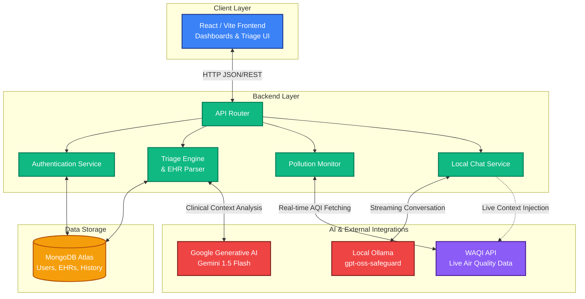

# Bharat PulseLink – Hospital Intelligence & Clinical Triage
*India's Shared Memory for Every Patient, Every Hospital*

[](https://react.dev)
[](https://www.typescriptlang.org/)
[](https://nodejs.org/)
[](https://www.mongodb.com/)
[](https://healthpluse-ai.netlify.app/)

**Bharat PulseLink** is a next-generation clinical intelligence system designed to address the critical challenges facing modern healthcare: rising patient volumes, limited staff, and the risks of manual triage.

By leveraging advanced Artificial Intelligence, this platform ensures **faster risk detection**, **accurate prioritization**, and **efficient department allocation**, transforming how emergency departments and clinics manage patient flow.

---

## 🌐 Live Application

| | |
|---|---|
| **Production URL** | [https://healthpluse-ai.netlify.app](https://healthpluse-ai.netlify.app) |
| **Frontend** | Deployed on Netlify (React 18 + Vite) |
| **Backend API** | Deployed on Render (Node.js + Express) |
| **Database** | MongoDB Atlas (Cloud-hosted, always-on) |
| **AI Engine** | Google Gemini 1.5 Flash + XGBoost ML Model |

> Recommended: Use a Chromium-based browser (Chrome, Edge) on desktop for the full experience.

---

## Core Capabilities

Bharat PulseLink replaces inconsistent manual processes with a data-driven, automated workflow:

### Intelligent Triage & Risk Assessment
- **Real-time Data Collection**: Capture vitals, symptoms, and medical history via a streamlined digital interface.
- **AI-Driven Classification**: Instantly stratifies patients into **Low**, **Medium**, or **High** risk categories using clinical machine learning models.
- **Confidence Scoring**: Provides a transparent risk score and confidence level to support clinical decision-making.

### Dynamic Prioritization & Workflow
- **Smart Queue Management**: Automatically sorts patients by severity rather than arrival time, ensuring critical cases are seen first.
- **Department Allocation**: AI recommendations for appropriate medical departments based on symptoms and vitals.
- **EHR Integration**: Securely stores patient records in MongoDB for long-term tracking and analytics.

### Automated Documentation
- **Instant EHR Reports**: Generates professional PDF reports of the triage assessment for immediate use by doctors.
- **File Parsing**: Upload past medical records (PDF/DOCX), and the system automatically extracts and auto-fills medical history.

### Environmental & Resource Intelligence
- **Live Pollution & Epidemic Tracking**: Monitors AQI and disease outbreaks to anticipate care demand surges.
- **Resource Planning**: Dashboard insights help administrators allocate staff proactively during high-risk periods.

---

## Architecture & Tech Stack

The system is built as a robust **MERN** (MongoDB, Express, React, Node) application with a modern, component-driven frontend and a secure API layer.

### Architecture Diagram



### Frontend
- **Framework**: React 18 + TypeScript
- **Build Tool**: Vite (Lightning-fast HMR)
- **Styling**: Tailwind CSS + ShadCN UI (Modern, accessible components)
- **Visualization**: Recharts (Interactive analytics)
- **Reporting**: jsPDF (Client-side PDF generation)

### Backend
- **Server**: Node.js + Express
- **Database**: MongoDB (Atlas/Local) with Mongoose ORM
- **Intelligence**: Integrated Python / Gemini AI services for text parsing and risk prediction
- **Security**: Helmet, CORS, and JWT-based authentication

### External Services
- **WAQI**: Real-time Air Quality Index
- **OpenWeather**: Environmental conditions
- **News API**: Health alerts and epidemic tracking
- **Google Generative AI**: Advanced unstructured text parsing

---

## Project Structure

```text
Bharat PulseLink/
├─ backend/                   # Express Server & API Logic
│  ├─ routes/                 # API Endpoints (Triage, HER, Auth)
│  ├─ models/                 # Mongoose Database Schemas
│  ├─ services/               # Clinical Logic & AI Integration
│  └─ server.js               # Application Entry Point
├─ src/                       # React Frontend Application
│  ├─ components/
│  │  ├─ PatientTriage.tsx    # Core AI Assessment Interface
│  │  ├─ PatientHistory.tsx   # Digital Archives & Filtering
│  │  ├─ DashboardPage.tsx    # Real-time Analytics Dashboard
│  │  └─ ...                  # Visualization & Utility Components
│  ├─ services/               # Frontend API Clients (triageService, auth)
│  ├─ context/                # Global State Management
│  └─ styles/                 # Global Theme & Tailwind Config
├─ build/                     # Optimized Production Build
└─ README.md                  # Project Documentation
```

---

## Getting Started

### 1. Prerequisites
- **Node.js** (v18 or later)
- **MongoDB** (Local or Atlas URI)

### 2. Installation
```bash
# Clone the repository
git clone https://github.com/akash14102006/Quiet-Coders.git

# Install dependencies (Root)
npm install
```

### 3. Running Locally
You can run both the frontend and backend concurrently:

```bash
# Start Frontend (Vite) & Backend (Express)
npm run dev      # Term 1: Frontend
npm run backend  # Term 2: Backend
```
*Frontend runs on `http://localhost:5173` | Backend runs on `http://localhost:3001`*

---

## Configuring External Data Sources

The production deployment connects to live external APIs by default. To configure your own API keys for a self-hosted instance:

1. Navigate to ⚙️ **Settings** in the dashboard.
2. Enter your API keys for:
   - **WAQI** — Real-time Air Quality Index
   - **OpenWeather** — Environmental conditions
   - **News API** — Health alerts & epidemic tracking
3. Click **Save Configuration** — the dashboard will immediately connect to live data streams.

---

*Built by **Quiet-Coders** — Transforming emergency healthcare with AI-driven clinical intelligence.*
